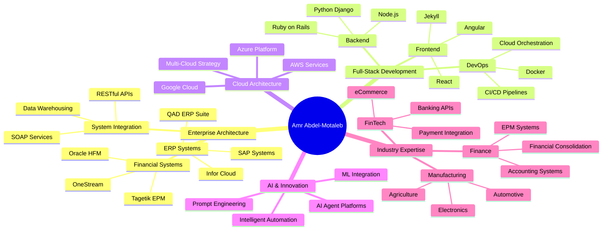

<div align="center">

# 👋 Hi, I'm Amr Abdel-Motaleb

**Solutions Architect | ERP Specialist | Full-Stack Developer**

[](https://linkedin.com/in/amrabdel)
[](https://bashconsultants.com)
[](mailto:amr.abdel@gmail.com)
[](https://github.com/bamr87/cv/blob/main/cv.pdf)

</div>

---

## 🚀 About Me

I'm a **Solutions Architect** and **ERP Specialist** based in Denver, CO, with **15+ years** of experience designing and implementing enterprise systems that drive manufacturing and business operations worldwide. I specialize in bridging the gap between business processes and technology solutions, with a focus on financial systems and operational efficiency.

**Current Roles:**
- 🏢 **ERP Architect** @ AESSE Investments (April 2025 - Present)
- 💼 **Solutions Architect** @ BASH Consulting LLC (January 2020 - Present)

### 🎯 What I Do

- 🏗️ **Enterprise Architecture**: Design scalable ERP solutions (QAD, Infor, SAP) for global manufacturing operations
- 💻 **Full-Stack Development**: Build custom web applications using Django, Ruby on Rails, Angular, and modern JavaScript
- 🤖 **AI Integration**: Develop AI-powered platforms, content management systems, and intelligent automation solutions
- ☁️ **Cloud Architecture**: Design and manage infrastructure on AWS, Azure, and GCP with CI/CD pipelines
- 📊 **Data & Analytics**: Create BI dashboards (PowerBI), data warehouses, and operational reporting systems
- 🔗 **System Integration**: Design seamless integrations between ERP, CRM, banking systems, and third-party applications
- 💰 **Financial Systems**: Configure and optimize accounting information systems, GL structures, and financial consolidation platforms

### 🌟 Specializations

```
Enterprise Systems    → QAD ERP, Infor Cloud Suite, Oracle HFM, OneStream EPM
Programming           → Python, Bash, Ruby, JavaScript, C#, SQL, LaTeX
Cloud Platforms       → AWS, Azure, GCP, Power Automate
Data Engineering      → DataBricks, Postgres, MySQL, BigQuery, Teradata
DevOps & CI/CD        → Git, Docker, Automated Testing, Server Orchestration
AI & Automation       → AI Agent Platforms, Prompt Engineering, Process Automation
```

---

## 💼 Professional Experience Highlights

### 🔷 AESSE Investments - ERP Architect (2025-Present)
Leading enterprise architecture for polymers and automotive manufacturing across North America, focusing on ERP governance, technical oversight, and strategic roadmap development.

### 🔷 BASH Consulting LLC - Solutions Architect (2020-Present)
Providing comprehensive IT/Finance consulting across FinTech and manufacturing sectors:
- ✅ Full-stack development of enterprise web applications
- ✅ AI-powered content management systems
- ✅ Cloud eCommerce integrations and architecture
- ✅ BI dashboard development and financial modeling
- ✅ Multi-cloud infrastructure management (AWS, GCP, Azure)

### 🔷 Valmont Industries - Sr. Manager Financial Systems (2022-2023)
Led global accounting systems strategy for agriculture and infrastructure manufacturing:
- ✅ Designed Mexico localization compliance solutions with IFS integration
- ✅ Implemented centralized financial systems (BlackLine, OneStream, SAP Concur)
- ✅ Developed enterprise data warehouses and BI reporting infrastructure

### 🔷 Previous Roles
- **AsteelFlash**: Global Business Analyst - Finance (2018-2020)
- **Wolters Kluwer**: Senior Business Consultant - Tagetik EPM (2017-2018)
- **QAD Inc.**: Finance IT Business Consultant (2014-2017)
- **Infor Global Solutions**: Applications Consultant (2012-2014)
- **Navistar International**: ERP/Baan Specialist & Financial Analyst (2009-2012)le
author: Amr
class: Wizard
---

<!---
bamr87/bamr87 is a ✨ special ✨ repository because its `README.md` (this file) appears on your GitHub profile.
You can click the Preview link to take a look at your changes.
--->

- 👋 Hello world, I’m Amr, I hail from Denver, CO
- 🤖 I'm a guru of IT system achitectures designed to facilitate the means of production (e.g., ERPs)
- 📚 Mastering the full stack by writing about it (it-journey.dev), desining it, (zer0-mistakes.com), and scaling it (barodybroject.com)
- 🧐 Open to collaborate on new ways to incorporate sustainibility vs profit as a value based ERP driver (i.e., how to quantify environmental impact when competing with profit)
- 📫 You can reach me at @bamr87

---

## 🛠️ Technical Stack

<details>
<summary><b>📦 Enterprise Applications</b></summary>

- **ERP Systems**: QAD (SE, EE, Mfg/Pro, eB2, AUX), Infor (SyteLine, LN, Baan IV), SAP
- **Financial Management**: Oracle HFM, OneStream, Tagetik EPM, PeopleSoft Financials
- **Specialized**: QAD EAM, Oracle Agile PLM, BlackLine, SAP Concur

</details>

<details>
<summary><b>💻 Programming & Scripting</b></summary>

```
Primary:     Python, Bash, Ruby, JavaScript, SQL
Secondary:   PowerShell, C#, Visual Basic, PHP
Specialized: Progress 4GL, LaTeX, MDX, DAX
Web:         HTML5, CSS3, XML, JSON
```

</details>

<details>
<summary><b>🗄️ Databases & Data Platforms</b></summary>

- **Cloud**: DataBricks, Google BigQuery, AWS DynamoDB
- **Relational**: Microsoft SQL Server, PostgreSQL, MySQL, Oracle SQL
- **Specialized**: Progress DB, Teradata

</details>

<details>
<summary><b>📊 Analytics & BI Tools</b></summary>

- PowerBI, Alteryx, Python (Pandas, NumPy, Matplotlib)
- SQL, DAX, MDX
- Hyperion Reporting Studio, OBIEE Dashboards

</details>

<details>
<summary><b>☁️ Cloud & DevOps</b></summary>

- **Cloud Platforms**: AWS, Azure, Google Cloud Platform
- **DevOps**: Git, Docker, CI/CD Pipelines, Automated Testing
- **Integration**: RESTful APIs, SOAP, QXtend, Apache Tomcat
- **Automation**: Microsoft Power Automate, Zapier

</details>

<details>
<summary><b>🤖 AI & Modern Development</b></summary>

- AI Agent Platform Development
- Prompt Engineering
- Django & Ruby on Rails frameworks
- Angular & React front-end development
- Jekyll static site generators

</details>

---

## 📚 Learning & Knowledge Sharing

I believe in continuous learning and sharing knowledge. I document my journey through three interconnected platforms:

### 🎯 IT-Journey.dev
**Technical Blog & Knowledge Base**
- 📖 In-depth tutorials on enterprise systems
- 🛠️ DevOps and cloud architecture guides
- 💡 Problem-solving case studies
- 🗺️ Learning roadmaps for IT professionals

### 🎨 Zer0-Mistakes.com
**Design Patterns & Best Practices**
- 🏗️ Software architecture patterns
- ✨ UI/UX design principles
- 🔧 Code quality and refactoring techniques
- 📐 System design methodologies

### 🚀 BarodyBroject.com
**Full-Stack Application Showcase**
- 🌐 Live web applications and demos
- 🧪 Experimental projects and prototypes
- 🔗 Integration showcases
- 📊 Data visualization examples

[](https://roadmap.sh)

---

## 🏆 Key Strengths

<table>
  <tr>
    <td>
      <ul>
        <li>✅ Financial Data Modeling</li>
        <li>✅ Full-Stack Development</li>
        <li>✅ AI Engineering</li>
      </ul>
    </td>
    <td>
      <ul>
        <li>✅ Data Warehouse Design</li>
        <li>✅ BI Reporting</li>
        <li>✅ System Integrations</li>
      </ul>
    </td>
    <td>
      <ul>
        <li>✅ DevOps & CI/CD</li>
        <li>✅ Business Process Modeling</li>
        <li>✅ Financial System Design</li>
      </ul>
    </td>
    <td>
      <ul>
        <li>✅ ERP System Design</li>
        <li>✅ ERP Implementations</li>
        <li>✅ IT Cloud Architecture</li>
      </ul>
    </td>
  </tr>
</table>

---

## 🌍 Project Portfolio Highlights

### 💼 BASH Consulting LLC (2020-Present)
- 🏢 **4 Enterprise Systems Projects**: QAD EE upgrades, ERP integrations, banking interfaces, OneStream/HFM implementations
- 📊 **2 Accounting System Projects**: QAD entity segmentation, QuickBooks configuration
- 🔧 **3 Custom Software Projects**: Inventory tracking systems, home inspection platform (Ruby/JavaScript)
- ☁️ **Data Governance**: System design for RPM Telco and financial systems

### 🏭 Valmont Industries (2022-2023)
- 🔄 **3 Centralization Projects**: BlackLine Cash App, SAP Concur, BlackLine GL
- 🔗 **4 ERP Interfaces**: Supplier portal, invoice automation, account reconciliation, OneStream direct connect
- 📈 **4 Data Analytics Projects**: Revenue recognition InfoMart, GL InfoMart (QAD & IFS), AR InfoMart
- 📊 **BI & Reporting**: Centralized COA reporting, enterprise entity modeling

### 🌐 Global Manufacturing (2014-2020)
- 🚀 **20+ ERP Implementations**: QAD EE, SAP, SyteLine across North America, Europe, Asia
- 🔐 **Multiple EPM Projects**: Tagetik, HFM, OneStream implementations
- 📡 **Integration Solutions**: Bank drivers, supplier portals, automated invoicing
- 🛠️ **Specialized Systems**: EAM, FAM, lease management, document repositories

---

## 🎓 Education

**Bachelor of Science (BS), Finance**  
*University of Illinois at Urbana-Champaign*  
Focus: Financial Analysis, Quantitative Methods, Information Systems

---

## 🤝 Let's Collaborate

I'm passionate about exploring innovative solutions, particularly in:

- 🌱 **Sustainable ERP Design**: Incorporating environmental impact metrics alongside profit measures
- 🤖 **AI-Powered Business Systems**: Intelligent automation and decision support
- 📊 **Data-Driven Operations**: Real-time analytics for manufacturing and financial systems
- 🔗 **Modern Integration Patterns**: Microservices, APIs, and cloud-native architectures

### 📬 Get In Touch

- 💼 **LinkedIn**: [linkedin.com/in/amrabdel](https://linkedin.com/in/amrabdel)
- 🌐 **Website**: [bashconsultants.com](https://bashconsultants.com)
- 📧 **Email**: [amr.abdel@gmail.com](mailto:amr.abdel@gmail.com)
- 📄 **CV**: [Download PDF](https://github.com/bamr87/cv/blob/main/cv.pdf)
- 🐙 **GitHub**: [@bamr87](https://github.com/bamr87)

---

## 📊 GitHub Stats


---

## 🗺️ Career Journey Mindmap



---

## 📍 Location

Based in the beautiful state of Colorado, serving clients worldwide.

```geojson
{
  "type": "FeatureCollection",
  "features": [
    {
      "type": "Feature",
      "id": 1,
      "properties": {
        "name": "Colorado",
        "description": "Home Base - Denver Metro Area"
      },
      "geometry": {
        "type": "Polygon",
        "coordinates": [
          [
            [-109.05, 41.00],
            [-109.05, 37.00],
            [-102.05, 37.00],
            [-102.05, 41.00],
            [-109.05, 41.00]
          ]
        ]
      }
    }
  ]
}
```

---

## 🔺 3D Visualization - Penrose Triangle

An impossible object representing the intersection of technology, business, and innovation.

```stl
solid penrose_triangle
  facet normal 0.0 0.0 1.0
    outer loop
      vertex 0.0 0.0 0.0
      vertex 3.0 0.0 0.0
      vertex 1.5 2.598 0.0
    endloop
  endfacet
  facet normal 0.0 0.0 -1.0
    outer loop
      vertex 0.0 0.0 -0.5
      vertex 1.5 2.598 -0.5
      vertex 3.0 0.0 -0.5
    endloop
  endfacet
  facet normal 0.866 -0.5 0.0
    outer loop
      vertex 3.0 0.0 0.0
      vertex 3.0 0.0 -0.5
      vertex 1.5 2.598 -0.5
    endloop
  endfacet
  facet normal 0.866 -0.5 0.0
    outer loop
      vertex 3.0 0.0 0.0
      vertex 1.5 2.598 -0.5
      vertex 1.5 2.598 0.0
    endloop
  endfacet
  facet normal -0.866 -0.5 0.0
    outer loop
      vertex 0.0 0.0 0.0
      vertex 1.5 2.598 0.0
      vertex 1.5 2.598 -0.5
    endloop
  endfacet
  facet normal -0.866 -0.5 0.0
    outer loop
      vertex 0.0 0.0 0.0
      vertex 1.5 2.598 -0.5
      vertex 0.0 0.0 -0.5
    endloop
  endfacet
  facet normal 0.0 1.0 0.0
    outer loop
      vertex 0.0 0.0 0.0
      vertex 0.0 0.0 -0.5
      vertex 3.0 0.0 -0.5
    endloop
  endfacet
  facet normal 0.0 1.0 0.0
    outer loop
      vertex 0.0 0.0 0.0
      vertex 3.0 0.0 -0.5
      vertex 3.0 0.0 0.0
    endloop
  endfacet
  facet normal 0.0 -0.707 0.707
    outer loop
      vertex 1.5 2.598 0.0
      vertex 3.0 0.0 0.0
      vertex 2.25 1.299 0.25
    endloop
  endfacet
  facet normal -0.707 -0.707 0.0
    outer loop
      vertex 0.0 0.0 0.0
      vertex 0.75 1.299 0.25
      vertex 1.5 2.598 0.0
    endloop
  endfacet
  facet normal 0.707 0.0 0.707
    outer loop
      vertex 3.0 0.0 0.0
      vertex 0.0 0.0 0.0
      vertex 1.5 0.0 0.25
    endloop
  endfacet
endsolid
```

---

<div align="center">

### 💭 Philosophy

> "Technology should empower business, not constrain it. The best systems are invisible—they enable people to focus on value creation rather than fighting with tools."

**Building bridges between business strategy and technical excellence.**

---

*Last Updated: October 2025*

</div>

---

<details>
<summary><b>📝 Notes & Resources</b></summary>

> [!NOTE]
> This profile showcases my professional journey and current focus areas. It's continuously updated as I explore new technologies and methodologies.

> [!TIP]
> For a comprehensive view of my experience, check out my [detailed CV](https://github.com/bamr87/cv/blob/main/cv.pdf).

> [!IMPORTANT]
> This README uses YAML frontmatter for metadata—view the raw file to see the structured data!

### 🛠️ Quick Setup

```shell
# Clone this profile repository
gh repo clone bamr87/bamr87

# Open in your editor
code README.md
```

</details>
