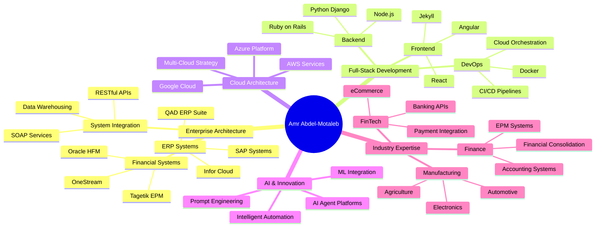

<div align="center">

# 👋 Hi, I'm Amr Abdel-Motaleb

**Solutions Architect | ERP Specialist | Full-Stack Developer**

I build sustainable enterprise systems and empower internal teams, transforming technology from a cost center into a strategic advantage.

[](https://linkedin.com/in/amrabdel)
[](https://bashconsultants.com)
[](mailto:amr.abdel@gmail.com)
[](https://github.com/bamr87/cv/blob/main/cv.pdf)

</div>

---

## 🚀 About Me

I'm a **Solutions Architect** and **ERP Specialist** based in Denver, CO, with **15+ years** of experience designing and implementing enterprise systems that drive manufacturing and business operations worldwide. My mission is to bridge the gap between complex business processes and effective technology, always prioritizing people and sustainable growth over vendor dependency.

### 🌟 My Philosophy: People Over Profits

- 🌱 **Sustainable Technology**: Building systems that adapt and scale with your business.
- 👥 **Employee Empowerment**: Transferring knowledge to make your team self-sufficient.
- 📚 **Knowledge Sharing**: Advancing our collective capabilities through open-source education.
- 🌍 **Balanced Innovation**: Integrating environmental and social impact as measurable business drivers.

---

## 🛠️ Technical Stack & Specializations

<details>
<summary><b>📦 Enterprise Applications</b></summary>

- **ERP Systems**: QAD (SE, EE, Mfg/Pro, eB2, AUX), Infor (SyteLine, LN, Baan IV), SAP
- **Financial Management**: Oracle HFM, OneStream, Tagetik EPM, PeopleSoft Financials
- **Specialized**: QAD EAM, Oracle Agile PLM, BlackLine, SAP Concur

</details>

<details>
<summary><b>💻 Programming & Scripting</b></summary>

```
Primary:     Python, Bash, Ruby, JavaScript, SQL
Secondary:   PowerShell, C#, Visual Basic, PHP
Specialized: Progress 4GL, LaTeX, MDX, DAX
Web:         HTML5, CSS3, XML, JSON
```

</details>

<details>
<summary><b>🗄️ Databases & Data Platforms</b></summary>

- **Cloud**: DataBricks, Google BigQuery, AWS DynamoDB
- **Relational**: Microsoft SQL Server, PostgreSQL, MySQL, Oracle SQL
- **Specialized**: Progress DB, Teradata

</details>

<details>
<summary><b>📊 Analytics & BI Tools</b></summary>

- PowerBI, Alteryx, Python (Pandas, NumPy, Matplotlib)
- SQL, DAX, MDX
- Hyperion Reporting Studio, OBIEE Dashboards

</details>

<details>
<summary><b>☁️ Cloud & DevOps</b></summary>

- **Cloud Platforms**: AWS, Azure, Google Cloud Platform
- **DevOps**: Git, Docker, CI/CD Pipelines, Automated Testing
- **Integration**: RESTful APIs, SOAP, QXtend, Apache Tomcat
- **Automation**: Microsoft Power Automate, Zapier

</details>

<details>
<summary><b>🤖 AI & Modern Development</b></summary>

- AI Agent Platform Development
- Prompt Engineering
- Django & Ruby on Rails frameworks
- Angular & React front-end development
- Jekyll static site generators

</details>

---

## 💼 Professional Experience

### 🔷 AESSE Investments - ERP Architect (2025-Present)
Leading enterprise architecture for polymers and automotive manufacturing across North America, focusing on ERP governance, technical oversight, and strategic roadmap development.

### 🔷 BASH Consulting LLC - Solutions Architect (2020-Present)
Providing comprehensive IT/Finance consulting with a mission-driven focus on employee empowerment and sustainable technology.

**Key Achievements**:
- ✅ **Enterprise Systems**: Led 4 major enterprise projects, including QAD EE upgrades, multi-system integrations (banking, supplier portals), and OneStream/HFM implementations for financial consolidation.
- ✅ **Accounting Modernization**: Re-engineered accounting systems through QAD entity segmentation and QuickBooks configurations for streamlined financial operations.
- ✅ **Custom Software Development**: Built 3 custom applications, including inventory tracking systems and a home inspection platform, using Ruby on Rails and JavaScript.
- ✅ **Cloud & Data Governance**: Designed robust data governance frameworks and system architecture for RPM Telco and other financial systems, managing multi-cloud environments across AWS, GCP, and Azure.
- ✅ **BI & Analytics**: Developed high-impact PowerBI dashboards, financial models, and operational reports to drive data-driven decision-making.
- ✅ **Skills Transfer Programs**: Successfully executed knowledge transfer programs, creating comprehensive documentation and training that empowered client teams to manage their systems independently.

### 🔷 Valmont Industries - Sr. Manager Financial Systems (2022-2023)
Led global accounting systems strategy for a multi-billion dollar agriculture and infrastructure manufacturer.
- ✅ **Compliance & Localization**: Designed and implemented a Mexico localization compliance solution with deep IFS integration.
- ✅ **System Centralization**: Drove 3 major centralization projects for BlackLine Cash App, SAP Concur, and BlackLine GL, standardizing processes across the enterprise.
- ✅ **Data Integration**: Architected 4 critical ERP interfaces for a supplier portal, invoice automation, account reconciliation, and a OneStream direct connect, improving data flow and efficiency.
- ✅ **Analytics & Reporting**: Built enterprise-grade data analytics solutions, including Revenue Recognition, GL, and AR InfoMarts, and developed a centralized Chart of Accounts (COA) reporting structure.

### 🔷 Previous Roles (2009-2022)
- **AsteelFlash - Global Business Analyst, Finance (2018-2020)**: Managed 20+ ERP implementations (QAD, SAP, SyteLine) across North America, Europe, and Asia.
- **Wolters Kluwer - Senior Business Consultant, Tagetik EPM (2017-2018)**: Implemented multiple EPM solutions (Tagetik, HFM, OneStream).
- **QAD Inc. - Finance IT Business Consultant (2014-2017)**: Specialized in EAM, FAM, and lease management systems.
- **Infor Global Solutions - Applications Consultant (2012-2014)**: Focused on Baan IV and Infor LN ERP solutions.
- **Navistar International - ERP/Baan Specialist & Financial Analyst (2009-2012)**: Started my career in ERP and financial analysis in a large-scale manufacturing environment.

---

## 🎯 Consulting Services

My consulting practice is built on a foundation of empowering your team and delivering sustainable, long-term value.

#### **Enterprise Architecture & ERP Solutions**
Transform business operations through manufacturing-focused ERP implementations and strategic technology planning.

- 🏗️ **ERP Implementation & Optimization**: QAD, Infor, Oracle, SAP systems for global manufacturing
- 🔄 **Legacy System Modernization**: Upgrade pathways and cloud migration strategies
- 🔗 **System Integration**: Banking interfaces, supplier portals, multi-system connectivity
- 📊 **Business Process Optimization**: Workflow automation, shop floor integration, lean manufacturing

#### **Financial Technology & Automation**
Streamline financial operations with enterprise-grade accounting technology and compliance solutions.

- 💰 **Financial Systems Design**: OneStream, BlackLine, Hyperion implementations
- 🤖 **Process Automation**: AP/AR automation, bank reconciliations, financial close acceleration
- 📈 **Enterprise Performance Management**: Consolidation, planning, budgeting, forecasting
- ✅ **Compliance Solutions**: SOX controls, GAAP/IFRS compliance, regulatory reporting

#### **Cloud & Full-Stack Development**
Build modern applications and cloud infrastructure that scale with your business.

- ☁️ **Cloud Architecture**: AWS, Azure, GCP design and management with CI/CD pipelines
- 🖥️ **Custom Application Development**: Django, Ruby on Rails, Angular web applications
- 🤖 **AI Integration**: Intelligent automation, AI agent platforms, prompt engineering
- 📊 **Data Engineering**: BI dashboards (PowerBI), data warehouses, analytics platforms

#### **IT Strategy & Employee Empowerment**
Future-proof your technology investments while building internal capabilities.

- 🎓 **Skills Development Programs**: Technical training, certification guidance, knowledge transfer
- 🏢 **Center of Excellence**: Innovation labs, best practice documentation, internal capabilities
- 🛡️ **Technology Risk Management**: Vendor independence strategies, cybersecurity frameworks
- 📋 **Strategic Advisory**: Technology roadmaps, investment planning, emerging tech evaluation

---

## 🤝 Let's Collaborate

I'm passionate about exploring innovative solutions that balance technology advancement with human values.

### 💡 Innovation & Collaboration Focus

- 🌱 **Sustainable ERP Design**: How can we quantify environmental impact alongside profit in ERP systems?
- 👥 **Empowerment Through Technology**: Developing programs that build internal capabilities, not vendor dependencies.
- 🤖 **AI-Augmented Intelligence**: Using AI to enhance human decision-making, not replace it.
- 🔗 **Future-Proof Architecture**: Designing modular, API-first systems that evolve with business needs.
- 📊 **Data-Driven Social Impact**: Using BI to measure and optimize financial, community, and environmental performance.

### 📬 Get In Touch

- 💼 **LinkedIn**: [linkedin.com/in/amrabdel](https://linkedin.com/in/amrabdel)
- 🌐 **Website**: [bashconsultants.com](https://bashconsultants.com)
- 📧 **Email**: [amr.abdel@gmail.com](mailto:amr.abdel@gmail.com)
- 📄 **CV**: [Download PDF](https://github.com/bamr87/cv/blob/main/cv.pdf)
- 🐙 **GitHub**: [@bamr87](https://github.com/bamr87)

---

## 📚 Learning & Knowledge Sharing

I believe in continuous learning and sharing knowledge. I document my journey through three interconnected platforms:

- 🎯 **[it-journey.dev](https://it-journey.dev)**: In-depth tutorials on enterprise systems, DevOps, and cloud architecture.
- 🎨 **[zer0-mistakes.com](https://zer0-mistakes.com)**: A showcase of software architecture patterns, UI/UX design, and system design methodologies.
- 🚀 **[barodybroject.com](https://barodybroject.com)**: A playground for full-stack applications, experimental projects, and integration showcases.

[](https://roadmap.sh)

---

## 📁 Repository Structure

This repository is organized as a **monorepo** using Git submodules, containing multiple independent projects:

```
bamr87/
├── cv/          # AI-powered CV/Resume Builder
├── README/      # Documentation Aggregation Hub  
├── scripts/     # Development & Automation Utilities
└── docs/        # Monorepo Documentation
```

### 🎨 CV Builder ([cv/](cv/))

**AI-powered CV/resume builder** with LaTeX templates and multiple export formats.

- **Tech Stack**: React, TypeScript, Vite, Tailwind CSS
- **Features**: LaTeX/Markdown/PDF export, AI parsing, Firebase auth
- **Live Demo**: Coming soon
- [📖 Documentation](cv/README.md)

### 📚 Documentation Hub ([README/](README/))

**Automated documentation aggregation** system that collects and organizes technical documentation from multiple repositories.

- **Tech Stack**: Python, MkDocs, Wiki.js
- **Features**: AI-powered categorization, multi-format support, search
- **Live Site**: [bamr87.github.io/bamr87](https://bamr87.github.io/bamr87)
- [📖 Documentation](README/README.md)

### 🛠️ Automation Scripts ([scripts/](scripts/))

**Collection of powerful CLI utilities** for project initialization, GitHub operations, and development workflows.

- **Tech Stack**: Bash, Python, Shell
- **Tools**: project-init, forkme, git-init, rename-directory
- **Features**: Interactive wizards, Docker integration, GitHub CLI
- [📖 Documentation](scripts/README.md)

### 🚀 Quick Start

Clone with all submodules:

```bash
git clone --recurse-submodules https://github.com/bamr87/bamr87.git
cd bamr87
./tools/setup-dev.sh
```

Or explore individual projects:

```bash
# CV Builder
cd cv && npm install && npm run dev

# Documentation Site  
mkdocs serve

# Scripts (standalone utilities)
./scripts/project-init.sh --help
```

### 📖 Documentation

- **[MONOREPO.md](docs/MONOREPO.md)**: Repository organization and submodule management
- **[DEVELOPMENT.md](docs/DEVELOPMENT.md)**: Development environment setup
- **[ARCHITECTURE.md](docs/ARCHITECTURE.md)**: System design and architecture decisions
- **[CONTRIBUTING.md](CONTRIBUTING.md)**: Contribution guidelines

---

## 🎓 Education

**Bachelor of Science (BS), Finance**  
*University of Illinois at Urbana-Champaign*  
Focus: Financial Analysis, Quantitative Methods, Information Systems

---

## 📊 GitHub Stats & Career Journey

<div align="center">


</div>



---

<div align="center">

*Last Updated: November 2025*

</div>---

<details>
<summary><b>📝 Notes & Resources</b></summary>

> [!NOTE]
> This profile showcases my professional journey and current focus areas. It's continuously updated as I explore new technologies and methodologies.

> [!TIP]
> For a comprehensive view of my experience, check out my [detailed CV](https://github.com/bamr87/cv/blob/main/cv.pdf).

> [!IMPORTANT]
> This README uses YAML frontmatter for metadata—view the raw file to see the structured data!

### 🛠️ Quick Setup

```shell
# Clone this profile repository
gh repo clone bamr87/bamr87

# Open in your editor
code README.md
```

</details>


---

<details>
<summary><b>📝 Notes & Resources</b></summary>

> [!NOTE]
> This profile showcases my professional journey and current focus areas. It's continuously updated as I explore new technologies and methodologies.

> [!TIP]
> For a comprehensive view of my experience, check out my [detailed CV](https://github.com/bamr87/cv/blob/main/cv.pdf).

> [!IMPORTANT]
> This README uses YAML frontmatter for metadata—view the raw file to see the structured data!

### 🛠️ Quick Setup

```shell
# Clone this profile repository
gh repo clone bamr87/bamr87

# Open in your editor
code README.md
```

</details>


---

<details>
<summary><b>📝 Notes & Resources</b></summary>

> [!NOTE]
> This profile showcases my professional journey and current focus areas. It's continuously updated as I explore new technologies and methodologies.

> [!TIP]
> For a comprehensive view of my experience, check out my [detailed CV](https://github.com/bamr87/cv/blob/main/cv.pdf).

> [!IMPORTANT]
> This README uses YAML frontmatter for metadata—view the raw file to see the structured data!

### 🛠️ Quick Setup

```shell
# Clone this profile repository
gh repo clone bamr87/bamr87

# Open in your editor
code README.md
```

</details>
