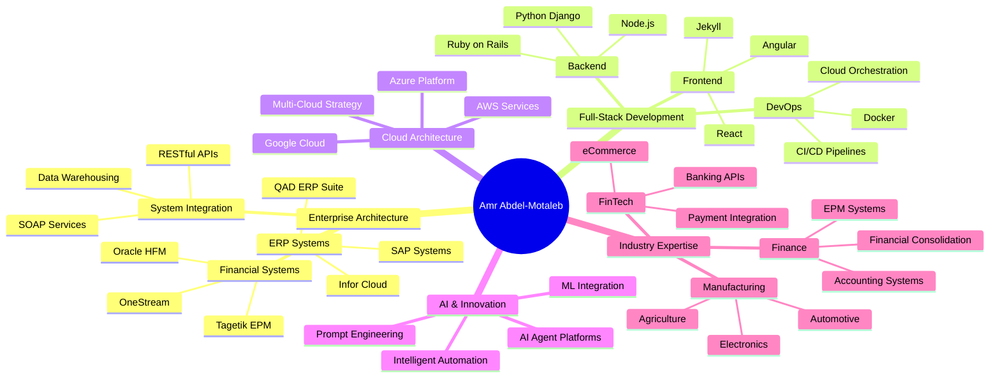

<div align="center">

# 👋 Hi, I'm Amr Abdel-Motaleb

**Solutions Architect | ERP Specialist | Full-Stack Developer**

[](https://linkedin.com/in/amrabdel)
[](https://bashconsultants.com)
[](mailto:amr.abdel@gmail.com)
[](https://github.com/bamr87/cv/blob/main/cv.pdf)

</div>

---

## 🚀 About Me

I'm a **Solutions Architect** and **ERP Specialist** based in Denver, CO, with **15+ years** of experience designing and implementing enterprise systems that drive manufacturing and business operations worldwide. I specialize in bridging the gap between business processes and technology solutions, with a focus on financial systems and operational efficiency.

**Current Roles:**
- 🏢 **ERP Architect** @ AESSE Investments (April 2025 - Present)
- 💼 **Solutions Architect** @ BASH Consulting LLC (January 2020 - Present)

### 🎯 Mission: People Over Profits

At BASH Consulting, I believe in a fundamentally different approach to technology consulting: **empowering your internal teams** and **future-proofing your technology investments** rather than creating vendor dependencies. My goal is not to make you reliant on external consultants, but to transfer knowledge, build capabilities, and establish frameworks that enable your organization to thrive independently.

**Core Philosophy:**
- 🌱 **Sustainable Technology**: Building systems that adapt and scale without requiring complete overhauls
- 👥 **Employee Empowerment**: Developing internal capabilities that provide long-term value and strategic control
- 🌍 **Balanced Innovation**: Exploring ways to incorporate environmental sustainability alongside profitability as core business drivers
- 📚 **Knowledge Transfer**: Measuring success by how self-sufficient your team becomes, not how dependent on consulting services

### 🎯 What I Do - Consulting Services

#### **Enterprise Architecture & ERP Solutions**
Transform business operations through manufacturing-focused ERP implementations and strategic technology planning.

- 🏗️ **ERP Implementation & Optimization**: QAD, Infor, Oracle, SAP systems for global manufacturing
- 🔄 **Legacy System Modernization**: Upgrade pathways and cloud migration strategies
- � **System Integration**: Banking interfaces, supplier portals, multi-system connectivity
- 📊 **Business Process Optimization**: Workflow automation, shop floor integration, lean manufacturing

#### **Financial Technology & Automation**
Streamline financial operations with enterprise-grade accounting technology and compliance solutions.

- 💰 **Financial Systems Design**: OneStream, BlackLine, Hyperion implementations
- 🤖 **Process Automation**: AP/AR automation, bank reconciliations, financial close acceleration
- 📈 **Enterprise Performance Management**: Consolidation, planning, budgeting, forecasting
- ✅ **Compliance Solutions**: SOX controls, GAAP/IFRS compliance, regulatory reporting

#### **Cloud & Full-Stack Development**
Build modern applications and cloud infrastructure that scale with your business.

- ☁️ **Cloud Architecture**: AWS, Azure, GCP design and management with CI/CD pipelines
- � **Custom Application Development**: Django, Ruby on Rails, Angular web applications
- 🤖 **AI Integration**: Intelligent automation, AI agent platforms, prompt engineering
- 📊 **Data Engineering**: BI dashboards (PowerBI), data warehouses, analytics platforms

#### **IT Strategy & Employee Empowerment**
Future-proof your technology investments while building internal capabilities.

- 🎓 **Skills Development Programs**: Technical training, certification guidance, knowledge transfer
- 🏢 **Center of Excellence**: Innovation labs, best practice documentation, internal capabilities
- �️ **Technology Risk Management**: Vendor independence strategies, cybersecurity frameworks
- 📋 **Strategic Advisory**: Technology roadmaps, investment planning, emerging tech evaluation

### 🌟 Specializations

```
Enterprise Systems    → QAD ERP, Infor Cloud Suite, Oracle HFM, OneStream EPM
Programming           → Python, Bash, Ruby, JavaScript, C#, SQL, LaTeX
Cloud Platforms       → AWS, Azure, GCP, Power Automate
Data Engineering      → DataBricks, Postgres, MySQL, BigQuery, Teradata
DevOps & CI/CD        → Git, Docker, Automated Testing, Server Orchestration
AI & Automation       → AI Agent Platforms, Prompt Engineering, Process Automation
```

---

## 💼 Professional Experience Highlights

### 🔷 AESSE Investments - ERP Architect (2025-Present)
Leading enterprise architecture for polymers and automotive manufacturing across North America, focusing on ERP governance, technical oversight, and strategic roadmap development.

### 🔷 BASH Consulting LLC - Solutions Architect (2020-Present)
Providing comprehensive IT/Finance consulting with a mission-driven focus on employee empowerment and sustainable technology:

**Philosophy**: *"Technology should empower people, not create dependencies. We measure success by how capable and self-sufficient client teams become."*

**Key Achievements**:
- ✅ **4 Enterprise ERP Projects**: QAD EE upgrades, multi-system integrations, banking interfaces, OneStream/HFM implementations
- ✅ **2 Accounting System Projects**: QAD entity segmentation, QuickBooks configuration
- ✅ **3 Custom Software Projects**: Inventory tracking, home inspection platform (Ruby/JavaScript)
- ✅ **Cloud Architecture & Data Governance**: RPM Telco system design, multi-cloud management (AWS, GCP, Azure)
- ✅ **BI & Analytics**: PowerBI dashboards, financial modeling, operational reporting
- ✅ **Skills Transfer Programs**: Technical training, internal capability development, knowledge documentation

### 🔷 Valmont Industries - Sr. Manager Financial Systems (2022-2023)
Led global accounting systems strategy for agriculture and infrastructure manufacturing:
- ✅ Designed Mexico localization compliance solutions with IFS integration
- ✅ Implemented centralized financial systems (BlackLine, OneStream, SAP Concur)
- ✅ Developed enterprise data warehouses and BI reporting infrastructure

### 🔷 Previous Roles
- **AsteelFlash**: Global Business Analyst - Finance (2018-2020)
- **Wolters Kluwer**: Senior Business Consultant - Tagetik EPM (2017-2018)
- **QAD Inc.**: Finance IT Business Consultant (2014-2017)
- **Infor Global Solutions**: Applications Consultant (2012-2014)
- **Navistar International**: ERP/Baan Specialist & Financial Analyst (2009-2012)

---

## 🛠️ Technical Stackle
author: Amr
class: Wizard
---

<!---
bamr87/bamr87 is a ✨ special ✨ repository because its `README.md` (this file) appears on your GitHub profile.
You can click the Preview link to take a look at your changes.
--->

- 👋 Hello world, I’m Amr, I hail from Denver, CO
- 🤖 I'm a guru of IT system achitectures designed to facilitate the means of production (e.g., ERPs)
- 📚 Mastering the full stack by writing about it (it-journey.dev), desining it, (zer0-mistakes.com), and scaling it (barodybroject.com)
- 🧐 Open to collaborate on new ways to incorporate sustainibility vs profit as a value based ERP driver (i.e., how to quantify environmental impact when competing with profit)
- 📫 You can reach me at @bamr87

---

## 🛠️ Technical Stack

<details>
<summary><b>📦 Enterprise Applications</b></summary>

- **ERP Systems**: QAD (SE, EE, Mfg/Pro, eB2, AUX), Infor (SyteLine, LN, Baan IV), SAP
- **Financial Management**: Oracle HFM, OneStream, Tagetik EPM, PeopleSoft Financials
- **Specialized**: QAD EAM, Oracle Agile PLM, BlackLine, SAP Concur

</details>

<details>
<summary><b>💻 Programming & Scripting</b></summary>

```
Primary:     Python, Bash, Ruby, JavaScript, SQL
Secondary:   PowerShell, C#, Visual Basic, PHP
Specialized: Progress 4GL, LaTeX, MDX, DAX
Web:         HTML5, CSS3, XML, JSON
```

</details>

<details>
<summary><b>🗄️ Databases & Data Platforms</b></summary>

- **Cloud**: DataBricks, Google BigQuery, AWS DynamoDB
- **Relational**: Microsoft SQL Server, PostgreSQL, MySQL, Oracle SQL
- **Specialized**: Progress DB, Teradata

</details>

<details>
<summary><b>📊 Analytics & BI Tools</b></summary>

- PowerBI, Alteryx, Python (Pandas, NumPy, Matplotlib)
- SQL, DAX, MDX
- Hyperion Reporting Studio, OBIEE Dashboards

</details>

<details>
<summary><b>☁️ Cloud & DevOps</b></summary>

- **Cloud Platforms**: AWS, Azure, Google Cloud Platform
- **DevOps**: Git, Docker, CI/CD Pipelines, Automated Testing
- **Integration**: RESTful APIs, SOAP, QXtend, Apache Tomcat
- **Automation**: Microsoft Power Automate, Zapier

</details>

<details>
<summary><b>🤖 AI & Modern Development</b></summary>

- AI Agent Platform Development
- Prompt Engineering
- Django & Ruby on Rails frameworks
- Angular & React front-end development
- Jekyll static site generators

</details>

---

## 📚 Learning & Knowledge Sharing

I believe in continuous learning and sharing knowledge. I document my journey through three interconnected platforms:

### 🎯 IT-Journey.dev
**Technical Blog & Knowledge Base**
- 📖 In-depth tutorials on enterprise systems
- 🛠️ DevOps and cloud architecture guides
- 💡 Problem-solving case studies
- 🗺️ Learning roadmaps for IT professionals

### 🎨 Zer0-Mistakes.com
**Design Patterns & Best Practices**
- 🏗️ Software architecture patterns
- ✨ UI/UX design principles
- 🔧 Code quality and refactoring techniques
- 📐 System design methodologies

### 🚀 BarodyBroject.com
**Full-Stack Application Showcase**
- 🌐 Live web applications and demos
- 🧪 Experimental projects and prototypes
- 🔗 Integration showcases
- 📊 Data visualization examples

[](https://roadmap.sh)

---

## 🏆 Key Strengths

<table>
  <tr>
    <td>
      <ul>
        <li>✅ Financial Data Modeling</li>
        <li>✅ Full-Stack Development</li>
        <li>✅ AI Engineering</li>
      </ul>
    </td>
    <td>
      <ul>
        <li>✅ Data Warehouse Design</li>
        <li>✅ BI Reporting</li>
        <li>✅ System Integrations</li>
      </ul>
    </td>
    <td>
      <ul>
        <li>✅ DevOps & CI/CD</li>
        <li>✅ Business Process Modeling</li>
        <li>✅ Financial System Design</li>
      </ul>
    </td>
    <td>
      <ul>
        <li>✅ ERP System Design</li>
        <li>✅ ERP Implementations</li>
        <li>✅ IT Cloud Architecture</li>
      </ul>
    </td>
  </tr>
</table>

---

## 🌍 Project Portfolio Highlights

### 💼 BASH Consulting LLC (2020-Present)
- 🏢 **4 Enterprise Systems Projects**: QAD EE upgrades, ERP integrations, banking interfaces, OneStream/HFM implementations
- 📊 **2 Accounting System Projects**: QAD entity segmentation, QuickBooks configuration
- 🔧 **3 Custom Software Projects**: Inventory tracking systems, home inspection platform (Ruby/JavaScript)
- ☁️ **Data Governance**: System design for RPM Telco and financial systems

### 🏭 Valmont Industries (2022-2023)
- 🔄 **3 Centralization Projects**: BlackLine Cash App, SAP Concur, BlackLine GL
- 🔗 **4 ERP Interfaces**: Supplier portal, invoice automation, account reconciliation, OneStream direct connect
- 📈 **4 Data Analytics Projects**: Revenue recognition InfoMart, GL InfoMart (QAD & IFS), AR InfoMart
- 📊 **BI & Reporting**: Centralized COA reporting, enterprise entity modeling

### 🌐 Global Manufacturing (2014-2020)
- 🚀 **20+ ERP Implementations**: QAD EE, SAP, SyteLine across North America, Europe, Asia
- 🔐 **Multiple EPM Projects**: Tagetik, HFM, OneStream implementations
- 📡 **Integration Solutions**: Bank drivers, supplier portals, automated invoicing
- 🛠️ **Specialized Systems**: EAM, FAM, lease management, document repositories

---

## 🎓 Education

**Bachelor of Science (BS), Finance**  
*University of Illinois at Urbana-Champaign*  
Focus: Financial Analysis, Quantitative Methods, Information Systems

---

## 🤝 Let's Collaborate

I'm passionate about exploring innovative solutions that balance technology advancement with human values:

### 🌟 Core Collaboration Areas

- 🌱 **Sustainable ERP Design**: Incorporating environmental impact metrics alongside profit measures as core KPIs in ERP systems. How can we quantify environmental impact when competing with profit-driven decisions?

- 👥 **Employee Empowerment Through Technology**: Developing programs that build internal capabilities rather than creating vendor dependencies. Transforming teams from technology consumers to technology creators.

- 🤖 **AI-Powered Business Intelligence**: Intelligent automation that enhances human decision-making rather than replacing human judgment. AI as augmentation, not replacement.

- 🔗 **Future-Proof Architecture**: Designing systems that evolve with business needs through modular, API-first, cloud-native patterns that reduce technical debt.

- 📊 **Data-Driven Social Impact**: Using business intelligence and analytics to measure and optimize both financial performance and community/environmental impact.

### 💡 Innovation Focus Areas

**Balancing Profit & Purpose**: Exploring how technology can help organizations pursue financial success while maintaining commitments to environmental sustainability and social responsibility. Can we design ERP systems that make "doing good" as measurable and rewarding as "making profit"?

**Knowledge Democratization**: Making enterprise-grade technology knowledge accessible through open-source education platforms (IT-Journey.dev, Zer0-Mistakes.com, BarodyBroject.com). Advancing our collective capabilities rather than hoarding expertise.

### 📬 Get In Touch

- 💼 **LinkedIn**: [linkedin.com/in/amrabdel](https://linkedin.com/in/amrabdel)
- 🌐 **Website**: [bashconsultants.com](https://bashconsultants.com)
- 📧 **Email**: [amr.abdel@gmail.com](mailto:amr.abdel@gmail.com)
- 📄 **CV**: [Download PDF](https://github.com/bamr87/cv/blob/main/cv.pdf)
- 🐙 **GitHub**: [@bamr87](https://github.com/bamr87)

---

## 📊 GitHub Stats


---

## 🗺️ Career Journey Mindmap



---

## 📍 Location

Based in the beautiful state of Colorado, serving clients worldwide.

```geojson
{
  "type": "FeatureCollection",
  "features": [
    {
      "type": "Feature",
      "id": 1,
      "properties": {
        "name": "Colorado",
        "description": "Home Base - Denver Metro Area"
      },
      "geometry": {
        "type": "Polygon",
        "coordinates": [
          [
            [-109.05, 41.00],
            [-109.05, 37.00],
            [-102.05, 37.00],
            [-102.05, 41.00],
            [-109.05, 41.00]
          ]
        ]
      }
    }
  ]
}
```

---

## 🔺 3D Visualization - Triforce

The legendary symbol of wisdom, courage, and power from The Legend of Zelda.

```stl
solid triforce
  # Bottom triangle - top face
  facet normal 0.0 0.0 1.0
    outer loop
      vertex 0.0 0.0 0.2
      vertex 1.0 0.0 0.2
      vertex 0.5 0.866 0.2
    endloop
  endfacet
  # Bottom triangle - bottom face
  facet normal 0.0 0.0 -1.0
    outer loop
      vertex 0.0 0.0 0.0
      vertex 0.5 0.866 0.0
      vertex 1.0 0.0 0.0
    endloop
  endfacet
  # Bottom triangle - front face
  facet normal 0.0 -1.0 0.0
    outer loop
      vertex 0.0 0.0 0.0
      vertex 1.0 0.0 0.0
      vertex 1.0 0.0 0.2
    endloop
  endfacet
  facet normal 0.0 -1.0 0.0
    outer loop
      vertex 0.0 0.0 0.0
      vertex 1.0 0.0 0.2
      vertex 0.0 0.0 0.2
    endloop
  endfacet
  # Bottom triangle - left face
  facet normal -0.866 0.5 0.0
    outer loop
      vertex 0.0 0.0 0.0
      vertex 0.5 0.866 0.0
      vertex 0.5 0.866 0.2
    endloop
  endfacet
  facet normal -0.866 0.5 0.0
    outer loop
      vertex 0.0 0.0 0.0
      vertex 0.5 0.866 0.2
      vertex 0.0 0.0 0.2
    endloop
  endfacet
  # Bottom triangle - right face
  facet normal 0.866 0.5 0.0
    outer loop
      vertex 1.0 0.0 0.0
      vertex 0.5 0.866 0.0
      vertex 0.5 0.866 0.2
    endloop
  endfacet
  facet normal 0.866 0.5 0.0
    outer loop
      vertex 1.0 0.0 0.0
      vertex 0.5 0.866 0.2
      vertex 1.0 0.0 0.2
    endloop
  endfacet

  # Top-left triangle - top face
  facet normal 0.0 0.0 1.0
    outer loop
      vertex -0.25 0.433 0.2
      vertex 0.25 0.433 0.2
      vertex 0.0 1.299 0.2
    endloop
  endfacet
  # Top-left triangle - bottom face
  facet normal 0.0 0.0 -1.0
    outer loop
      vertex -0.25 0.433 0.0
      vertex 0.0 1.299 0.0
      vertex 0.25 0.433 0.0
    endloop
  endfacet
  # Top-left triangle - left face
  facet normal -1.0 0.0 0.0
    outer loop
      vertex -0.25 0.433 0.0
      vertex -0.25 0.433 0.2
      vertex 0.0 1.299 0.2
    endloop
  endfacet
  facet normal -1.0 0.0 0.0
    outer loop
      vertex -0.25 0.433 0.0
      vertex 0.0 1.299 0.2
      vertex 0.0 1.299 0.0
    endloop
  endfacet
  # Top-left triangle - right face
  facet normal 0.5 0.866 0.0
    outer loop
      vertex 0.25 0.433 0.0
      vertex 0.0 1.299 0.0
      vertex 0.0 1.299 0.2
    endloop
  endfacet
  facet normal 0.5 0.866 0.0
    outer loop
      vertex 0.25 0.433 0.0
      vertex 0.0 1.299 0.2
      vertex 0.25 0.433 0.2
    endloop
  endfacet
  # Top-left triangle - bottom face
  facet normal 0.0 -1.0 0.0
    outer loop
      vertex -0.25 0.433 0.0
      vertex 0.25 0.433 0.0
      vertex 0.25 0.433 0.2
    endloop
  endfacet
  facet normal 0.0 -1.0 0.0
    outer loop
      vertex -0.25 0.433 0.0
      vertex 0.25 0.433 0.2
      vertex -0.25 0.433 0.2
    endloop
  endfacet

  # Top-right triangle - top face
  facet normal 0.0 0.0 1.0
    outer loop
      vertex 0.75 0.433 0.2
      vertex 1.25 0.433 0.2
      vertex 1.0 1.299 0.2
    endloop
  endfacet
  # Top-right triangle - bottom face
  facet normal 0.0 0.0 -1.0
    outer loop
      vertex 0.75 0.433 0.0
      vertex 1.0 1.299 0.0
      vertex 1.25 0.433 0.0
    endloop
  endfacet
  # Top-right triangle - left face
  facet normal -0.5 0.866 0.0
    outer loop
      vertex 0.75 0.433 0.0
      vertex 1.0 1.299 0.0
      vertex 1.0 1.299 0.2
    endloop
  endfacet
  facet normal -0.5 0.866 0.0
    outer loop
      vertex 0.75 0.433 0.0
      vertex 1.0 1.299 0.2
      vertex 0.75 0.433 0.2
    endloop
  endfacet
  # Top-right triangle - right face
  facet normal 1.0 0.0 0.0
    outer loop
      vertex 1.25 0.433 0.0
      vertex 1.25 0.433 0.2
      vertex 1.0 1.299 0.2
    endloop
  endfacet
  facet normal 1.0 0.0 0.0
    outer loop
      vertex 1.25 0.433 0.0
      vertex 1.0 1.299 0.2
      vertex 1.0 1.299 0.0
    endloop
  endfacet
  # Top-right triangle - bottom face
  facet normal 0.0 -1.0 0.0
    outer loop
      vertex 0.75 0.433 0.0
      vertex 1.25 0.433 0.0
      vertex 1.25 0.433 0.2
    endloop
  endfacet
  facet normal 0.0 -1.0 0.0
    outer loop
      vertex 0.75 0.433 0.0
      vertex 1.25 0.433 0.2
      vertex 0.75 0.433 0.2
    endloop
  endfacet
endsolid
```

---

<div align="center">

### 💭 Philosophy & Mission

> "Technology should empower people, not constrain them. The best systems are invisible—they enable teams to focus on value creation rather than fighting with tools. True success is measured not by dependency created, but by capability transferred."

**BASH Consulting Mission**: Building sustainable competitive advantages through employee empowerment and future-proof technology. We don't just implement systems—we transfer knowledge, build internal capabilities, and establish frameworks that enable organizations to thrive independently.

**Core Beliefs**:
- 🌱 **Sustainability Over Obsolescence**: Design systems that adapt and evolve, not require replacement
- 👥 **People Over Profits**: Measure success by team capability development, not consulting hours sold
- 📚 **Knowledge Sharing Over Gatekeeping**: Open-source education and transparent methodologies
- 🌍 **Purpose-Driven Technology**: Explore ways to incorporate environmental and social impact as measurable business drivers

*"We're not just balancing the books; we're balancing the planet."* - From the BASH Consulting philosophy of integrating profitability with sustainability and community impact.

---

*Last Updated: October 2025*

</div>

---

<details>
<summary><b>📝 Notes & Resources</b></summary>

> [!NOTE]
> This profile showcases my professional journey and current focus areas. It's continuously updated as I explore new technologies and methodologies.

> [!TIP]
> For a comprehensive view of my experience, check out my [detailed CV](https://github.com/bamr87/cv/blob/main/cv.pdf).

> [!IMPORTANT]
> This README uses YAML frontmatter for metadata—view the raw file to see the structured data!

### 🛠️ Quick Setup

```shell
# Clone this profile repository
gh repo clone bamr87/bamr87

# Open in your editor
code README.md
```

</details>
