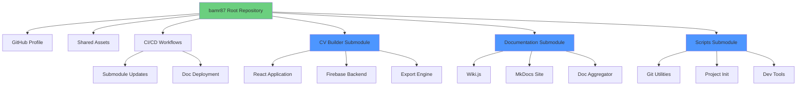
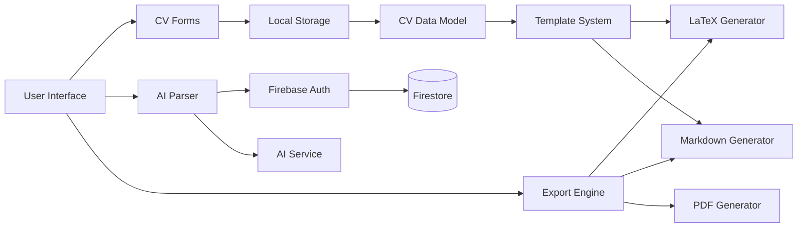
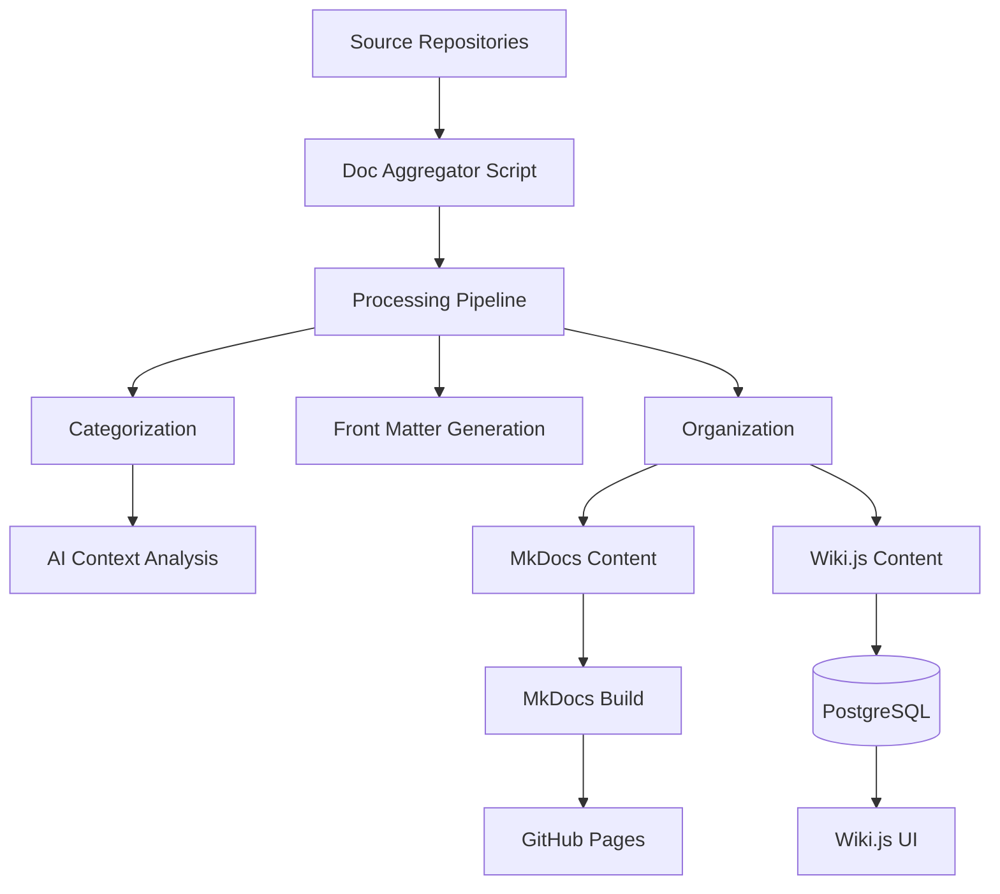
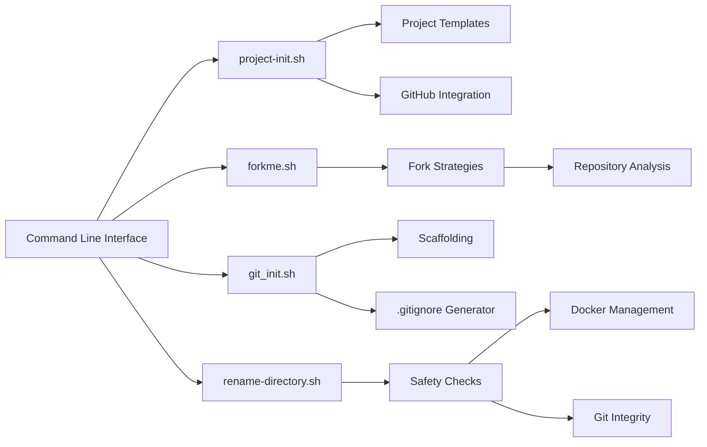
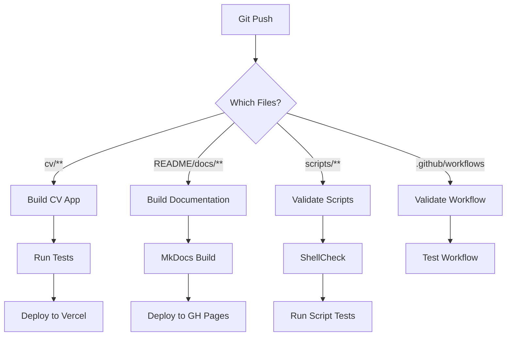
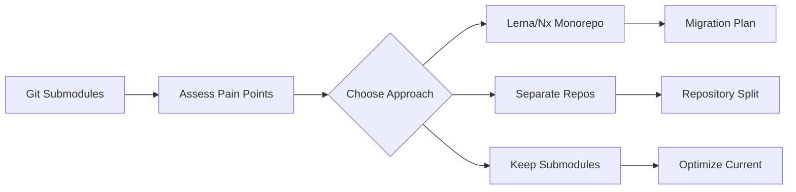

# Architecture Overview

This document describes the system architecture and design decisions for the bamr87 monorepo.

## System Overview

The bamr87 repository is organized as a **modular monorepo** using Git submodules, enabling independent development while maintaining centralized coordination.



## Design Principles

### 1. Modularity

Each major component is a separate Git submodule:
- **Independence**: Can be developed and deployed separately
- **Reusability**: Components can be used in other projects
- **Isolation**: Changes in one module don't affect others

### 2. Single Source of Truth

- Root repository coordinates all submodules
- Centralized CI/CD and automation
- Unified documentation and configuration

### 3. Separation of Concerns

```
├── Root Level      → Profile, coordination, shared assets
├── cv/             → Application development
├── README/         → Knowledge management
└── scripts/        → Automation and tooling
```

### 4. README-First Development

All components follow the README-First principle:
- Documentation created before code
- README serves as specification
- Living documentation updated with code

## Component Architecture

### CV Builder (cv/)

**Tech Stack**: React, TypeScript, Vite, Tailwind CSS, Firebase



**Key Features**:
- Client-side data persistence (localStorage)
- Optional Firebase authentication for AI features
- Multiple export formats (LaTeX, Markdown, PDF, ASCII)
- Template-based CV generation

**Data Flow**:
1. User enters data → Stored in localStorage
2. Optional: AI parses existing CV → Extracts structured data
3. User selects template → Data merged with template
4. Export generates final CV in chosen format

### Documentation Hub (README/)

**Tech Stack**: Python, MkDocs, Wiki.js, Docker



**Key Features**:
- Automated documentation aggregation from multiple repos
- AI-powered content categorization and tagging
- Dual rendering: MkDocs (static) and Wiki.js (dynamic)
- Version-controlled documentation with Git

**Data Flow**:
1. Scheduled workflow pulls docs from source repos
2. Python scripts process and categorize content
3. AI enhances front matter with tags and summaries
4. Organized docs pushed to docs/ directory
5. MkDocs builds static site → GitHub Pages
6. Wiki.js provides searchable, collaborative interface

### Automation Scripts (scripts/)

**Tech Stack**: Bash, Python, Shell



**Key Features**:
- Interactive and headless modes
- Extensive error handling and validation
- Docker integration for project management
- GitHub CLI integration for automation

## Data Models

### CV Builder Data Model

```typescript
interface CVData {
  personalInfo: PersonalInfo;
  experience: Experience[];
  education: Education[];
  skills: Skill[];
  projects: Project[];
  certifications: string[];
  languages: string[];
}
```

### Documentation Metadata

```yaml
---
title: Document Title
tags: [category, topic]
summary: AI-generated summary
source_repo: owner/repo
last_updated: 2025-01-15
---
```

## Infrastructure

### CI/CD Pipeline



### Deployment Strategy

| Component | Platform | Trigger | URL |
|-----------|----------|---------|-----|
| CV Builder | Vercel | Push to cv/main | cv-builder.vercel.app |
| Documentation | GitHub Pages | Push to README/docs | bamr87.github.io/bamr87 |
| Wiki.js | Docker/Self-hosted | Manual | localhost:3000 |
| Profile | GitHub | Push to main | github.com/bamr87 |

## Security Considerations

### Authentication & Authorization

- **CV Builder**: Optional Firebase auth for AI features only
- **Wiki.js**: Local authentication, not exposed publicly
- **GitHub Actions**: Uses `GITHUB_TOKEN` with minimal permissions

### API Keys Management

- **Never commit API keys** to repository
- CV Builder: User provides keys in settings (stored in Firestore)
- Documentation: Keys in GitHub Secrets for CI/CD
- Scripts: Use environment variables

### Data Privacy

- **CV Builder**: All data stored in user's browser (localStorage)
- **Documentation**: Public information only
- **No tracking** or analytics without explicit consent

## Performance Optimization

### CV Builder

- **Vite HMR**: Fast development with Hot Module Replacement
- **Code Splitting**: Lazy load AI parser and export modules
- **Local Storage**: Instant data persistence
- **Optimized Builds**: Tree-shaking and minification

### Documentation

- **Static Site Generation**: Pre-built HTML for fast loading
- **Incremental Builds**: Only rebuild changed pages
- **CDN Distribution**: GitHub Pages CDN
- **Search Optimization**: Client-side search index

### Submodule Operations

- **Shallow Clones**: Use `--depth 1` for CI/CD
- **Parallel Operations**: Use `git submodule foreach`
- **Cached Dependencies**: Cache npm/pip in CI/CD

## Scalability

### Horizontal Scaling

- **CV Builder**: Stateless design, can scale on Vercel
- **Documentation**: Static files, CDN scalable
- **Wiki.js**: Can scale with PostgreSQL clustering

### Vertical Scaling

- **Documentation Aggregation**: Optimize Python processing
- **AI Processing**: Batch requests to reduce costs
- **Build Times**: Incremental builds, caching strategies

## Monitoring & Observability

### Current Monitoring

- **GitHub Actions**: Workflow run logs
- **Vercel**: Deployment logs and analytics
- **Git**: Commit history and branch tracking

### Planned Improvements

- Error tracking (Sentry)
- Performance monitoring (Web Vitals)
- Documentation analytics
- Build time optimization metrics

## Future Architecture Considerations

### Potential Enhancements

1. **Microservices**: Consider splitting large submodules
2. **Shared Library**: Extract common utilities
3. **GraphQL API**: Unified data access layer
4. **Containerization**: Full Docker Compose stack
5. **CDN Assets**: Separate asset hosting

### Migration Path

If migrating away from submodules:



## Design Decisions Log

### Why Git Submodules?

**Decision**: Use Git submodules instead of monorepo tools (Lerna, Nx)

**Rationale**:
- Independent deployment and versioning
- Smaller clone sizes for contributors
- Existing separate repositories
- No additional tooling required
- Flexibility to migrate later

**Trade-offs**:
- More complex Git operations
- Coordination required for cross-module changes
- Potential for submodule pointer drift

### Why Multiple Documentation Systems?

**Decision**: Use both MkDocs (static) and Wiki.js (dynamic)

**Rationale**:
- MkDocs: Public documentation, version control
- Wiki.js: Internal knowledge base, collaboration
- Different use cases, different strengths

**Trade-offs**:
- Content duplication possible
- Two systems to maintain
- More complex setup

## Questions & Feedback

For architecture questions or suggestions:
- Open an issue with `architecture` label
- Discuss in GitHub Discussions
- Review existing ADRs (Architecture Decision Records)

---

**Last Updated**: January 2025  
**Maintained by**: Amr Abdel-Motaleb (@bamr87)
