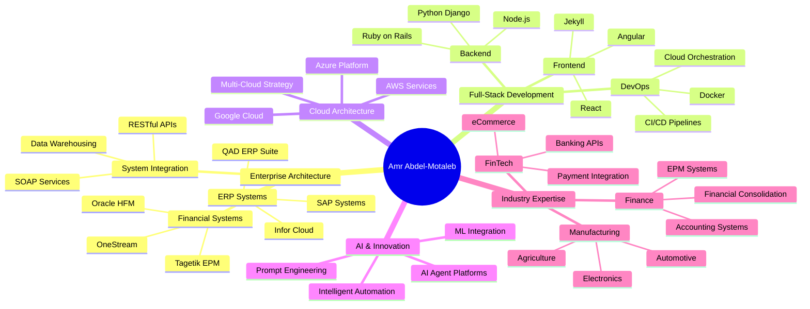

# 👋 Hi, I'm Amr Abdel-Motaleb

**Solutions Architect · ERP Specialist · Full-Stack Developer**

I build sustainable enterprise systems and empower internal teams, transforming
technology from a cost center into a strategic advantage.

[Connect on LinkedIn](https://linkedin.com/in/amrabdel){: .btn .btn-primary }
[bashconsultants.com](https://bashconsultants.com){: .btn .btn-outline-secondary }
[Download CV](https://github.com/bamr87/cv/blob/main/cv.pdf){: .btn .btn-outline-secondary }

---

## Explore

- 🚀 **[About](/about/)** — who I am and the technology I work with
- 💼 **[Experience](/experience/)** — 15+ years across ERP, finance systems, and engineering
- 🎯 **[Services](/services/)** — how I help teams build sustainable systems
- 🌐 **[Projects](/projects/)** — open-source tools, docs platforms, and apps
- ✍️ **[Blog](/blog/)** — notes on architecture, DevOps, and AI workflows
- 📬 **[Contact](/contact/)** — let's collaborate

---

## ⭐ Featured Projects

A snapshot of what I'm actively building — see the [full portfolio](/projects/) for everything.



  

    

      

        <h5 class="card-title"><a href="{{ p.repo_url }}">{{ p.name }}</a></h5>
        {{ p.status }}
        
{{ p.description }}

        
<code class="me-1">{{ t }}</code>

      

      

        <a class="btn btn-sm btn-outline-secondary" href="{{ p.repo_url }}">Repo</a>
        <a class="btn btn-sm btn-outline-primary" href="{{ p.live_url }}">Live</a>
        <a class="btn btn-sm btn-outline-info" href="{{ p.docs_url }}">Docs</a>
      

    

  



---

## My Philosophy: People Over Profits

- 🌱 **Sustainable Technology** — building systems that adapt and scale with your business.
- 👥 **Employee Empowerment** — transferring knowledge to make your team self-sufficient.
- 📚 **Knowledge Sharing** — advancing collective capability through open-source education.
- 🌍 **Balanced Innovation** — treating environmental and social impact as measurable business drivers.

## Learning & Knowledge Sharing

I document my journey through three interconnected platforms:

- 🎯 **[it-journey.dev](https://it-journey.dev)** — tutorials on enterprise systems, DevOps, and cloud architecture.
- 🎨 **[zer0-mistakes.com](https://zer0-mistakes.com)** — software architecture patterns, UI/UX, and system design.
- 🚀 **[barodybroject.com](https://barodybroject.com)** — full-stack applications and integration showcases.

---

## Career at a Glance

